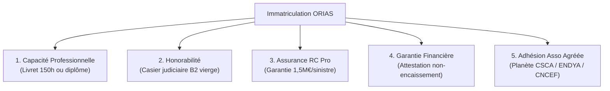

# 🛡️ DOSSIER STRATÉGIQUE & PLAN D'ACCRÉDITATION ORIAS / ACPR
## Projet mon50ccetmoi — Transformation en Agence de Courtage Local & Digital (Insurtech)
**Document de Référence Réglementaire, Stratégique et Opérationnel**  
**Date d'établissement** : 26 septembre 2026  
**Porteur du projet** : Xavier Le Chanu (Entrepreneur Individuel — SIRET 891 912 503 00036)  
**Entité visée** : Cabinet de Courtage d'Assurances en micro-mobilité & 2-roues (50cc, VSP, EDPM, VAE)

---

## 1. VISION & OBJECTIF STRATÉGIQUE

L'officialisation de la démarche de courtage local via l'immatriculation à l'**ORIAS** (Organisme pour le Registre unique des Intermédiaires en Assurance, Banque et Finance) constitue le pivot économique central du projet **mon50ccetmoi**.

### Les bénéfices clés pour l'entreprise :
1. **Crédibilité & Confiance Institutionnelle** : Statut d'intermédiaire régulé placé sous la tutelle de l'**ACPR** (Banque de France), garantissant une transparence totale auprès des conducteurs, des parents d'adolescents (qui financent l'assurance), et des partenaires constructeurs/garages.
2. **Souveraineté sur la Valeur Client (LTV)** : Fin du modèle d'apporteur d'affaires (où le client est cédé pour une commission unique de 15 à 30 €). L'agence devient propriétaire de son portefeuille de contrats d'assurance, générant des **commissions récurrentes d'encaissement (10 % à 25 % par an par contrat)** tant que l'assuré reste actif.
3. **Monétisation de la Télémétrie & de l'IoT** : Capacité de négocier des conventions exclusives avec les compagnies d'assurance et courtiers grossistes (April Moto, AMV, Mutuelle des Motards, Sada, etc.) en faisant valoir les algorithmes prédictifs (`MecaPredictor`, score BVC, détection Guardian Angel et boîtier ESP32 certifié e-Soleau).

---

## 2. STATUT JURIDIQUE & CATÉGORIE D'INTERMÉDIATION

Conformément à l'**Article R. 511-2 du Code des assurances**, l'activité est positionnée dans la catégorie suivante :

* **Catégorie 1 : Courtier d'assurance ou de réassurance (COA)**
  * Personne physique ou morale immatriculée au registre du commerce pour le courtage d'assurance.
  * Agit en tant que **mandataire de l'assuré** (client final) et non de la compagnie d'assurance.
  * Possède la liberté totale de recommander le contrat le plus adapté au besoin réel de l'assuré (indépendance capitalistique).

*(Option d'étape rapide envisageable : **Catégorie 4 - MIA (Mandataire d'Intermédiaire d'Assurance)** via un accord cadre avec un courtier grossiste avant bascule définitive en COA).*

---

## 3. PARCOURS DE FORMATION PROFESSIONNELLE & CAPACITÉ (NIVEAU I)

Pour prétendre à l'immatriculation en tant que Courtier d'assurance, le dirigeant doit justifier de la **Capacité Professionnelle de Niveau I - IAS** (Art. R. 512-8 à R. 512-10 du Code des assurances) :

### A. Stage Professionnel de Niveau I (150 heures)
* **Durée** : **150 heures d'enseignements théoriques et pratiques**.
* **Programme officiel homologué** :
  * Tronc commun : Environnement juridique, économique et réglementaire de l'assurance.
  * Droit des assurances : Formation, exécution, nullité et résiliation du contrat d'assurance.
  * Réglementation de la distribution : Directive DDA, règles de bonne conduite, prévention des conflits d'intérêts, devoir de conseil.
  * Assurances de dommages aux biens et de responsabilité (spécialisation Auto/Moto/Micro-mobilité, conventions IRSA/IRCA).
  * Traitement des réclamations, lutte anti-blanchiment (LCB-FT), RGPD et protection de la clientèle.
* **Organismes certificateurs habilités** : IFPASS, ESA, AF2A, ENASS, Francis Lefebvre Formation.
* **Financements mobilisables** : MonCompteFormation (CPF), Plan de développement des compétences, OPCO ou aides régionales/France Travail.

### B. Formation Continue DDA Obligatoire
* En vertu de la **Directive sur la Distribution d'Assurances (DDA - Art. L. 511-2)** :
* **15 heures minimum de formation continue chaque année** pour maintenir l'habilitation et la conformité du cabinet.

---

## 4. DOSSIER D'IMMATRICULATION ORIAS (LES 5 EXIGENCES OBLIGATOIRES)

Pour valider l'inscription sur le registre unique consultable sur `www.orias.fr` :



1. **Justificatif de Capacité Professionnelle** :
   * Livret de stage de 150 heures ou attestation officielle de formation Niveau I délivrée par l'organisme agréé.
2. **Condition d'Honorabilité** :
   * L'ORIAS effectue directement une demande d'extrait du **bulletin n° 2 du casier judiciaire** auprès du Casier Judiciaire National (absence de condamnations pour infractions financières, escroquerie, faux, abus de confiance).
3. **Assurance Responsabilité Civile Professionnelle (RC Pro Courtier)** :
   * Police d'assurance spécifique obligatoire conforme à l'article L. 512-6 du Code des assurances.
   * Plafond minimal légal : **1 500 000 € par sinistre** et **2 000 000 € par année d'assurance**.
   * Courtiers assureurs spécialisés : CGPA, Matmut Entreprises, Hiscox, Beazley.
4. **Garantie Financière (Caution)** :
   * *Choix stratégique mon50ccetmoi* : **Attestation de non-encaissement de fonds de tiers**.
   * Les primes d'assurance seront directement prélevées par les compagnies ou courtiers grossistes partenaires (Revolut/SEPA direct assureur). Ce choix dispense légalement de déposer la garantie financière de 115 000 €, allégeant considérablement les besoins en fonds propres.
5. **Adhésion à une Association Professionnelle Agréée (Loi n° 2021-402 du 8 avril 2021)** :
   * Obligation d'adhérer à l'une des associations représentatives agréées par l'ACPR :
     * **Planète CSCA** (leader du courtage en France).
     * **ENDYA** (Association dédiée aux courtiers et mandataires).
     * **CNCEF Assurance**.
   * L'association valide la complétude du dossier préalablement à l'enregistrement ORIAS.

---

## 5. IMPACT SUR LE MODÈLE ÉCONOMIQUE (BUSINESS PLAN 2026-2028)

### Comparatif Unitaire par Assuré

| Indicateur | Ancien Modèle (Affiliation simple) | Nouveau Modèle (Courtier Agréé ORIAS) |
|---|---|---|
| **Revenu Année 1** | 20 € (prime de mise en relation unique) | **85 €** (Frais d'ouverture 40 € + 15 % commission sur prime annuelle de 300 €) |
| **Revenu Année 2** | 0 € | **45 €** (Commission récurrente de maintien en portefeuille) |
| **Revenu Année 3** | 0 € | **45 €** (Commission récurrente de maintien en portefeuille) |
| **Valeur Client sur 3 ans (LTV)** | **20 €** | **175 € (+775 %)** |
| **Actif Patrimonial du Cabinet** | 0 € | Portefeuille valorisable entre **1,5× et 2,5×** les commissions annuelles récurrentes |

### Projections sur 1 000 Conducteurs Assurés Actifs :
* **Revenus Récurrents Annuels de Courtage** : `1 000 × 45 € =` **45 000 € / an** de commissions nettes passives.
* **Frais de Courtage Nouveaux Clients (flux 500/an)** : `500 × 40 € =` **20 000 € / an**.
* **Valeur Patrimoniale d'Apport du Portefeuille** : ~**90 000 € à 110 000 €** d'actif incorporel net cessible.

---

## 6. FEUILLE DE ROUTE D'IMPLÉMENTATION APPLICATIVE (CODE & CONFORMITÉ)

Dès l'inscription en formation et l'obtention du numéro d'immatriculation, les modules suivants de l'application seront activés :

### 1. Mentions Légales & Cartouche Réglementaire Obligatoire
Ajout dans [`src/mentions-legales.html`](file:///c:/Users/xavie/.gemini/antigravity-ide/scratch/com.mon50ccetmoi.tws-main/src/mentions-legales.html) et dans les pieds de page des devis générés :
```html
<div class="regulatory-card" style="border: 1px solid var(--accent); padding: 15px; border-radius: 8px;">
  <h4>Informations Réglementaires - Intermédiaire d'Assurance</h4>
  <p><strong>mon50ccetmoi</strong> est une marque éditée par Xavier Le Chanu, Courtier d'assurance (COA) immatriculé au Registre unique des intermédiaires sous le <strong>N° ORIAS : [En cours d'attribution]</strong> (vérifiable sur <a href="https://www.orias.fr" target="_blank">www.orias.fr</a>).</p>
  <p>Activité régie par le Code des assurances et placée sous le contrôle de l'<strong>Autorité de Contrôle Prudentiel et de Résolution (ACPR)</strong> — 4 Place de Budapest, CS 92459, 75436 Paris Cedex 09.</p>
  <p>Garantie financière et assurance de responsabilité civile professionnelle conformes aux articles L. 512-6 et L. 512-7 du Code des assurances souscrites auprès de [Compagnie], Police N° [XXXXXX]. Membre de l'association professionnelle agréée [Planète CSCA / ENDYA].</p>
</div>
```

### 2. Document d'Entrée en Relation (DER - Art. L. 521-2)
* Mise en place d'un composant modal interactif s'affichant avant toute simulation de prime sur [`src/insurance.html`](file:///c:/Users/xavie/.gemini/antigravity-ide/scratch/com.mon50ccetmoi.tws-main/src/insurance.html), précisant l'identité, l'absence de lien capitalistique exclusif avec un assureur, et les voies de réclamation / saisine du **Médiateur de l'Assurance**.

### 3. Recueil des Besoins & Devoir de Conseil Digitalisé (DDA)
* Algorithme guidé collectant : usage (trajet études, loisirs, livraison), lieu de stationnement (voie publique ou box clos), équipements de sécurité (casque homologué, gants CE, airbag, traceur antivol ESP32).
* Génération automatique d'une **Fiche de Conseil Précontractuelle** archivée horodatée dans Firestore pour prémunir le cabinet contre tout litige de distribution.

---

## 7. CALENDRIER OPÉRATIONNEL CIBLÉ

| Mois | Jalons Opérationnels |
|---|---|
| **M1 (Octobre 2026)** | Inscription et démarrage du stage professionnel Niveau I (150h e-learning). Constitution du dossier d'adhésion à l'association professionnelle (Planète CSCA ou ENDYA). |
| **M2 (Novembre 2026)** | Finalisation du stage et obtention du Livret de formation Niveau I. Négociation de la police de RC Pro Courtier (sans maniement de fonds). Dépôt du dossier en ligne sur le portail ORIAS. |
| **M3 (Décembre 2026)** | Réception du numéro ORIAS définitif. Négociation des codes courtiers auprès des grossistes (April Moto, AMV, etc.). Déploiement des mentions réglementaires et du DER sur l'application `mon50ccetmoi`. |
| **M4 (Janvier 2027)** | Lancement officiel des souscriptions de contrats d'assurance 50cc / micro-mobilité intégrés in-app avec réduction tarifaire boîtier IoT. |
